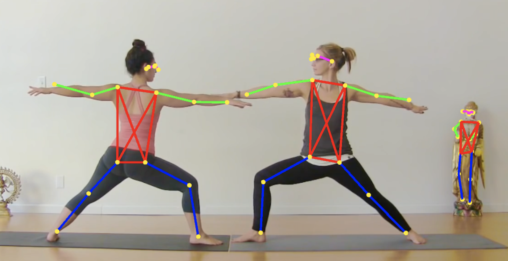
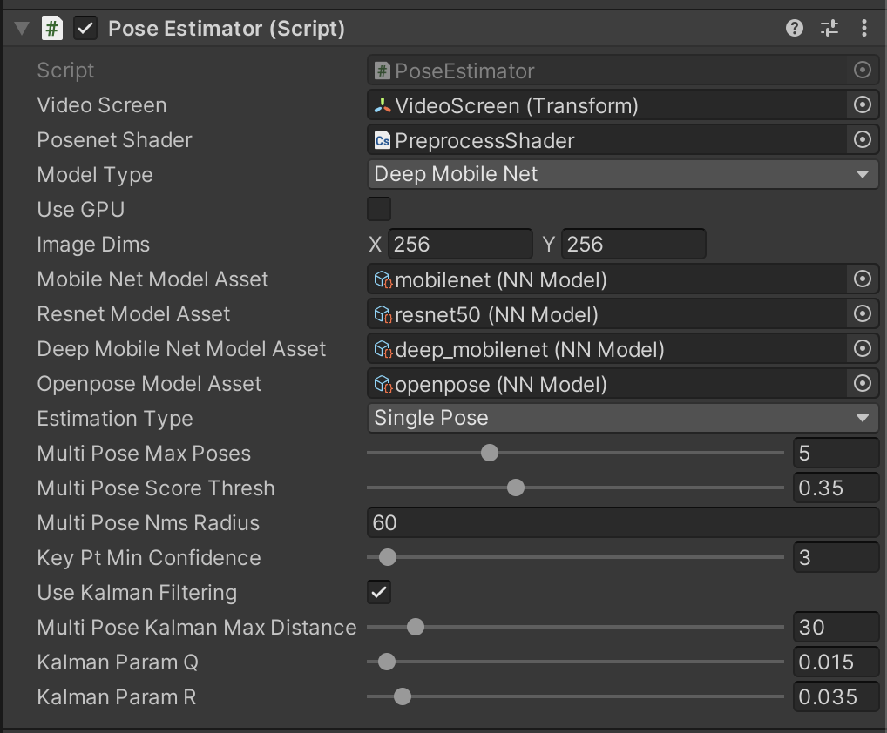

# Unity ML pose detection sandbox with Mike

## Outline
UML_skel3D is a ML-based multi-pose estimation made in Unity using barracuda, relying on precomputed models (onnx). Ironically, the 3D portion doesn't work yet, but I felt ambitious when the title was chosen.  

The project consists of posenet implementations using currently has 4 working* models:
- MobileNet
- ResNet50
- LightMobileNet (less layers)
- OpenPose (works only in single-pose estimation)

Most models performance could not be evaluated on GPU (only CPU), but should support it. On a good note, it works surprisingly fine on a macbook pro (SSD).  

This was made in Unity v.2020.03.18f1 

## Install
### Download and fill the missing files

1. Download/clone the repo locally, install Unity and Barracuda. 

2. Download the models from here, and put them in the 'Assets/Models' folder. 
https://drive.google.com/file/d/11Ry-VCO-epLli8cgFH_GPjVz6-HqU4xb/view?usp=sharing
 
### Settings in Unity Inspector

1. Drag the "ImRickJames" from the ""Assets/Scene" folder to the Hierarchy view. 

2. Choose a video from "Assets/Videos", and drag it to the "VideoScreen" game object ('Video Player/Video Clip')  

3. Drag the "PoseEstimation.cs" from "Assets/Script" and drag it to the "PoseEstimator" game object (where it says 'missing script').  

This should open the other fields to fill

## Tutorial 

・ Choose Video 
   You can choose the target video. 
   Put the video you choose in Assets/Video/, and then drag the file and drop it to Video Clip of "Video Player". 
   
   
・Choose Avatar 
    There are two types of avatar in this Scene. 
    You can change the avatar easily in inspector view. 
    Firstly activate Gameobject named as "Tait" and deactivate "unitychan". 
    Secondly drag the Gameobject and drop it to "V Nect Model" of "BarracudaRunner". 
     
    
    *To determin direction of the face of avatar, a gameobject which works as nose has been added in those of avatars.
     So if you would like to adopt your original avatar, please add the nose referencing the code.
     
・Use Web Camera
   By checking "Use Web Cam", you can change the input images. 
    
   
・Skip On Drop 
   If "Skip On Drop" in Video Player checked, VideoPlayer is allowed to skip frames to catch up with current time. 

## License
### Non-commercial use 
・Please use it freely for research.  

  
  
